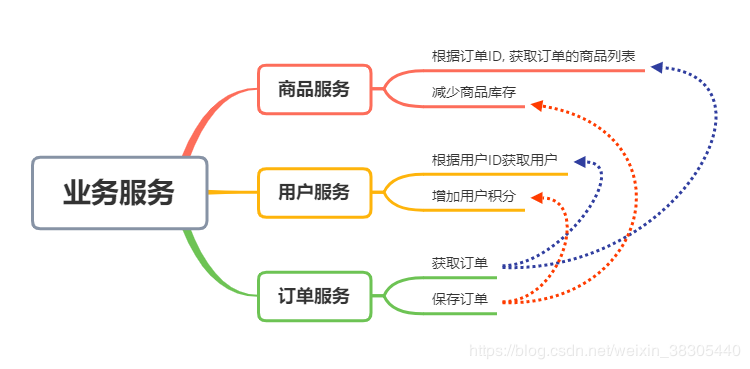
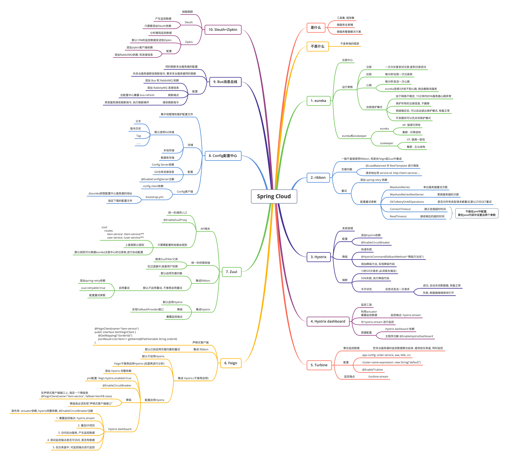
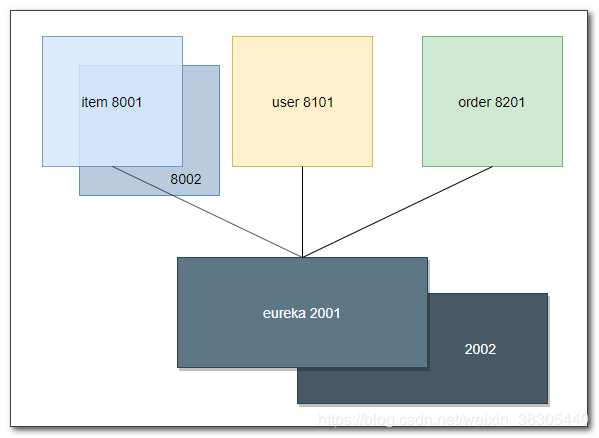
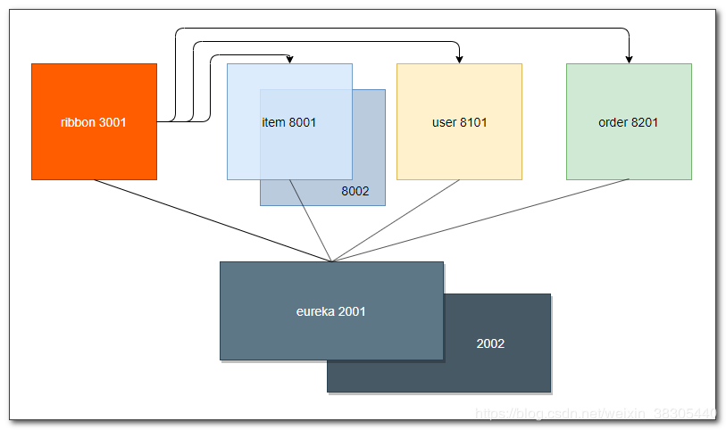
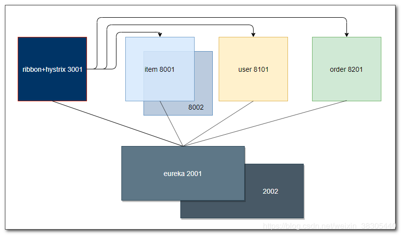
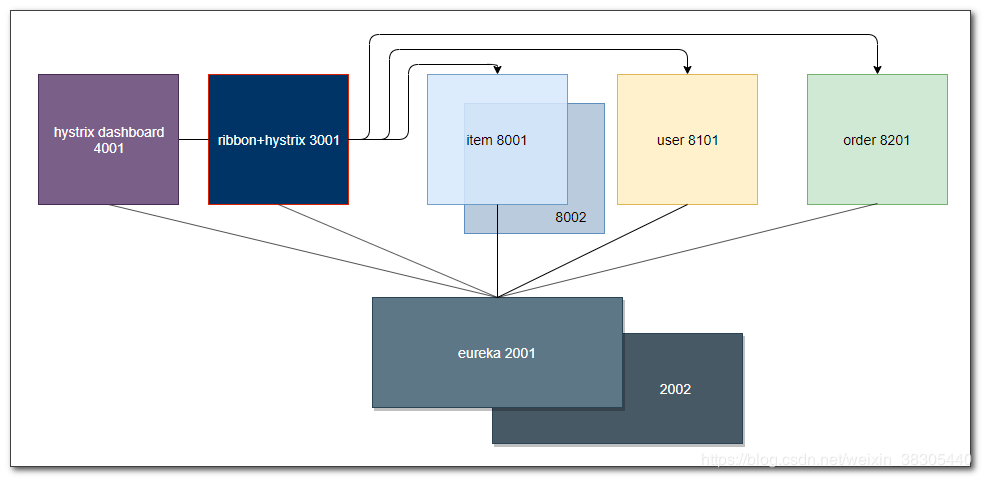
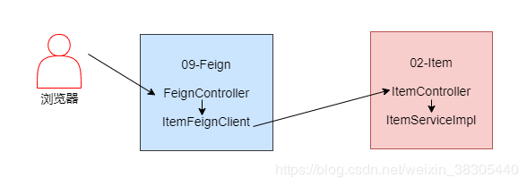

# Spring-Cloud
> - About: [源志bx](http://blog.yanbingxu.com/)
> - 该项目为学习 Spring-Cloud 微服务所用, 如有错误欢迎指正
> - 文档在个人博客中编写, 欢迎访问 [blog.yanbingxu.com](http://blog.yanbingxu.com/)

---
## 项目结构

### SpringCloud

- [sp01-commons](./sp01-commons): 通用项目
- [sp02-itemservice](./sp02-itemservice): 商品服务 (提供者)
- [sp03-userservice](./sp03-userservice): 用户服务 (提供者)
- [sp04-orderservice](./sp04-orderservice): 订单服务 (提供者)
- [sp05-eureka](./sp05-eureka): Eureka 服务器
- [sp06-ribbon](./sp06-ribbon): Ribbon(负载均衡 重试) Hystrix(降级 熔断) (调用者)
- [sp08-hystrix-dashboard](./sp08-hystrix-dashboard): Hystrix dashboard (监控工具)
- [sp09-feign](./sp09-feign): Feign(负载均衡 重试) Hystrix(降级 熔断) (调用者)

### RabbitMQ

- [rabbitmq](./rabbitmq): RabbitMQ 消息中间件

```
├─SC
│  ├─sp01-commons
│  ├─sp02-itemservice
│  ├─sp03-userservice
│  ├─sp04-orderservice
│  ├─sp05-eureka
│  ├─sp06-ribbon
│  │  ├─Ribbon (负载均衡 重试)
│  │  └─Hystrix (降级 熔断)
│  ├─sp08-hystrix-dashboard
│  └─sp09-feign
├─RabbitMQ
│  ├─rabbitmq
```



---
## 内容



### sp05-eureka



### sp06-ribbon Ribbon
 


### sp06-ribbon Hystrix



### sp08-hystrix-dashboard

- hystrix dashboard 断路器仪表盘


### sp09-feign



---
## 开发环境
> - OS: **macOS 10.15.3 / CentOS 7**
> - 语言: **JDK 1.8**
> - IDE: **IDEA 2020.1**
> - 依赖管理: **Maven 3.6.0**
> - 数据库: **MySQL 5.7.24**

---
## 联系
- `网站 1(博客)：` [blog.yanbingxu.com](https://blog.yanbingxu.com/)
- `网站 2(项目)：` [yanbingxu.com](http://yanbingxu.com/) (建设中)
- `CSDN：` [me.csdn.net/qq_44153697](https://me.csdn.net/qq_44153697)
- `Email：` <ybx0729@163.com>